# Adaptive RAG Chat — README

A Streamlit app that mixes **RAG over your documents**, **tool-augmented agents**, and **multimodal outputs** (images & charts). Upload PDFs/TXT, the app indexes them to Pinecone, auto-generates concise summaries, and lets you chat in three modes:

- **LangGraph Engine** (custom state graph: RAG + chart/image routing + in-text citations)
- **OpenAI Agent** (function tools: RAG, citations, charts, images)
- **LangChain Agent** (ReAct with structured tools)


## Features

- **Document ingestion**: Split PDFs/TXT into chunks and upsert to Pinecone, per-file namespaces.
- **Auto summaries**: Generates a short summary per uploaded file (stored in `summaries/`).
- **Three chat modes**:
  - **LangGraph** pipeline (routing: image/chart/RAG → retrieval → grading → re-query → final answer → add citations).
  - **OpenAI Agent** with function tools (RAG, `add_citations`, QuickChart URL builder, DALL·E image generation).
  - **LangChain Agent** using ReAct with the same toolset.
- **Citations**: Answers can be annotated with `[filename.ext]` after each paragraph.
- **Charts**: Builds **QuickChart** URLs from natural language; includes URL normalizer for base64/JSON configs.
- **Images**: Generates images locally via OpenAI Images; renders them in chat.
- **Multi-chat**: Create multiple chats, switch, and view tool traces/steps.

---

## Architecture

**Core flow (LangGraph Engine)**

1. Classify request → *needs image?* → *needs chart?* → else proceed.
2. If files are attached → decide **use RAG** from summaries → retrieve top-k chunks from Pinecone.
3. **Grade** chunks & summaries → either answer, or **transform query** and re-retrieve.
4. Generate final answer → **add in-text citations**.
5. If image or chart was requested, return that directly.

**Agents**

- **OpenAI Agent**: custom lightweight agent that calls function tools.
- **LangChain Agent**: ReAct agent via `langgraph.prebuilt.create_react_agent`.

---

## Project Structure

```
.
├─ streamlit_app.py            # UI, chat manager, file upload, chart URL normalization, render logic
├─ chat_engine.py              # LangGraph engine: nodes, routing, citations, DALL·E
├─ chat_engine_langchain.py    # LangChain ReAct agent + tools (RAG, chart, image, citations)
├─ chat_engine_openai.py       # OpenAI Agent (function tools) + tools
├─ create_index.py             # PDF/TXT loader, splitter, upsert to Pinecone
├─ pinecone_client.py          # Pinecone init + index factory
├─ rag_summary.py              # Simple vector store wrapper + summary RAG helper
├─ uploads/                    # (created at runtime) uploaded files
├─ summaries/                  # (created at runtime) auto-generated summaries per file
└─ generated_images/           # (created at runtime) images from DALL·E
```


## Installation

```bash
git clone <your-repo-url>
cd <your-repo-dir>

# (recommended) create venv
python -m venv .venv
# Windows:
. .venv/Scripts/activate
# macOS/Linux:
source .venv/bin/activate

pip install -r requirements.txt
```

## Configuration

Create a `.env` file in the project root:

```env
OPENAI_API_KEY=sk-...
PINECONE_API_KEY=...
PINECONE_INDEX_NAME=developer-quickstart-py
```

Notes:

- `pinecone_client.py` will create the index if missing (`developer-quickstart-py` by default) and configure the embedding field map for `chunk_text`.
- The app saves generated images to `generated_images/`, and summaries to `summaries/`.

---

## Running the App

```bash
streamlit run streamlit_app.py
```

Open the URL shown in your terminal (typically `http://localhost:8501`).

---

## Using the App

1. **Upload files**  
   Use the sidebar to upload **PDF** or **TXT**. Each file:
   - is ingested to Pinecone (its **namespace** is the filename),
   - gets an auto-generated summary saved into `summaries/<file>.txt`.

2. **Create or select a chat**  
   Click **New Chat** in the right column, then select it from the list.

3. **Choose a mode** (sidebar radio):
   - **LangGraph Engine**
   - **OpenAI Agent**
   - **LangChain Agent**

4. **Ask a question**  
   Optionally select one or more uploaded files to attach (enables RAG).  
   Ask your question in the input field and press **Send**.

5. **View results**  
   - If the answer is a **QuickChart** URL, the app will render the chart.
   - If the answer is a **local image path**, the app displays the image.
   - For RAG answers, expand **Intermediate Steps / Tool Calls** to inspect traces.

---

## How It Works (under the hood)

**Core flow (LangGraph Engine)**



### Indexing & Summaries
- `create_index.py` loads & splits documents (recursive splitter with overlap) and upserts chunks:
  - `namespace = filename`
  - field `chunk_text` contains the chunk content
- `rag_summary.py` queries top-k chunks and asks a model to produce a concise summary, saved in `summaries/`.

### Retrieval & Grading
- `chat_engine.py` retrieves from Pinecone via the custom `pinecone_client.index.search`.
- Chunks are **graded** (kept/rejected) by an LLM to ensure only relevant context is used.

### Citations
- `add_intext_citations` inserts `[filename.ext]` per paragraph based on file summaries and attached namespaces.

### Chart Generation
- Tools produce **QuickChart** URLs.  
- `streamlit_app.py` includes `normalize_quickchart(...)` to:
  - accept both **URL-encoded JSON** (preferred) and **base64** configs,
  - set `encoding=base64` when needed,
  - sanitize/query-encode configs.

### Image Generation
- Images are created with OpenAI Images and stored under `generated_images/`, then displayed in chat.

---

a mode, attach files (for RAG), and ask away 🚀
